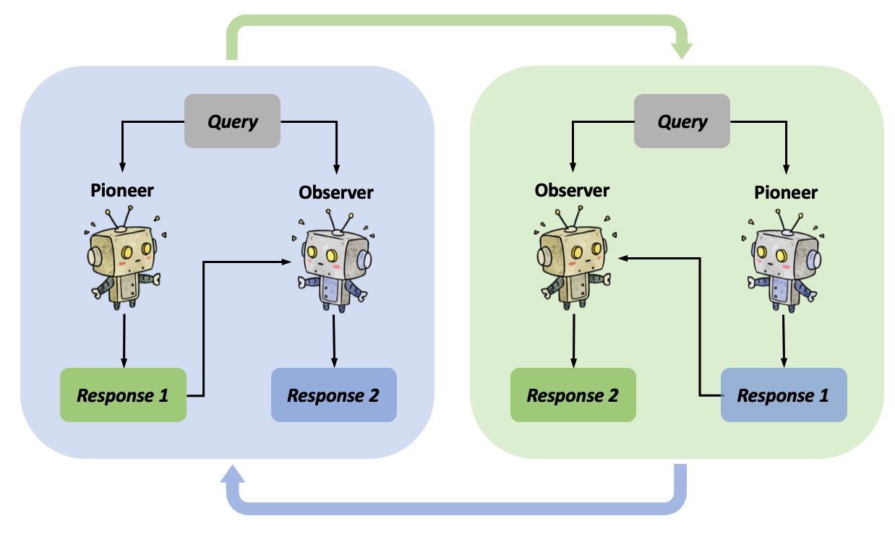

<h1 align="center">Coevolving with the OtheR You</h1>

Official implementation of the NeurIPS 2024 paper Coevolving with the Other You: Fine-Tuning LLM
with Sequential Cooperative Multi-Agent
Reinforcement Learning.

# Overview

Reinforcement learning (RL) has emerged as a pivotal technique for fine-tuning
large language models (LLMs) on specific tasks. However, prevailing RL fine-tuning methods predominantly rely on PPO and its variants. Though these algorithms are effective in general RL settings, they often exhibit suboptimal performance and vulnerability to distribution collapse when applied to the fine-tuning of
LLMs. In this paper, we propose CORY, extending the RL fine-tuning of LLMs to
a sequential cooperative multi-agent reinforcement learning framework, to leverage
the inherent coevolution and emergent capabilities of multi-agent systems. In
CORY, the LLM to be fine-tuned is initially duplicated into two autonomous agents:
a pioneer and an observer. The pioneer generates responses based on queries, while
the observer generates responses using both the queries and the pioneer’s responses.
The two agents are trained together. During training, the agents exchange roles
periodically, fostering cooperation and coevolution between them. Experiments
evaluate CORY’s performance by fine-tuning GPT-2 and Llama-2 under subjective
and objective reward functions on the IMDB Review and GSM8K datasets, respec-
tively. Results show that CORY outperforms PPO in terms of policy optimality,
resistance to distribution collapse, and training robustness, thereby underscoring its
potential as a superior methodology for refining LLMs in real-world applications.

<p align="center">
  
  <br>
  <b>Basic Idea of CORY</b>
</p>


# How to Setup Environment

To ensure that you can run the code in the same environment as it was developed, we recommend using the Conda environment management tool to replicate our development environment. Follow the steps below to quickly set up your environment.

## 1. Install Conda

If you haven't already installed Conda, please visit the [Anaconda website](https://www.anaconda.com/products/individual) to download and install Anaconda. Anaconda is a free and open-source distribution of Python and R programming languages for scientific computing, that aims to simplify package management and deployment. After installation, you can check if it was successful by opening a terminal or command prompt and typing the following command:

```bash
conda --version
```

## 2. Replicate Conda Environment

We have provided a trl_environment.yml file that contains all the dependencies required to run the code. Please follow the steps below to create and activate the environment:

create conda environment
```bash
conda env create -n new_env_name -f trl_environment.yml
```
activate the environment
```bash
conda env create -n new_env_name -f trl_environment.yml
```

# How to run
1. Download gpt-2 model and distilbert-imdb
2. Run the following command:

Fine-tuning with PPO
```python
python imdb_train/ppo.py
```
Fine-tuning with CORY
```python
python imdb_train/cory.py
```

# Citation
If you find this repository useful, please cite our [paper](https://proceedings.neurips.cc/paper_files/paper/2024/hash/1c2b1c8f7d317719a9ce32dd7386ba35-Abstract-Conference.html):
```
@inproceedings{NEURIPS2024_1c2b1c8f,
 author = {Ma, Hao and Hu, Tianyi and Pu, Zhiqiang and Boyin, Liu and Ai, Xiaolin and Liang, Yanyan and Chen, Min},
 booktitle = {Advances in Neural Information Processing Systems},
 editor = {A. Globerson and L. Mackey and D. Belgrave and A. Fan and U. Paquet and J. Tomczak and C. Zhang},
 pages = {15497--15525},
 publisher = {Curran Associates, Inc.},
 title = {Coevolving with the Other You: Fine-Tuning LLM with Sequential Cooperative Multi-Agent Reinforcement Learning},
 url = {https://proceedings.neurips.cc/paper_files/paper/2024/file/1c2b1c8f7d317719a9ce32dd7386ba35-Paper-Conference.pdf},
 volume = {37},
 year = {2024}
}
```

# Statement

We will continue to maintain this code repository in the coming months.
